# SWP Entity Relationship Diagram

Generated from `safeworkplace-api/schema/entities/` and `feature-dev-template/src/entities/onboarding/types.ts`.

## Domain Summary

| # | Domain | Entities | Source |
|---|---|---|---|
| 1 | [Core / Auth](#1-core--auth) | User, Client, Session, Connection | `safeworkplace-api` |
| 2 | [Person & Intel](#2-person--intel) | Person, Email, PersonIntel, ReportIntel | `safeworkplace-api` |
| 3 | [Permissions](#3-permissions) | Role, Module, Permission | `safeworkplace-api` |
| 4 | [Categories & Workflows](#4-categories--workflows) | Category, Workflow | `safeworkplace-api` |
| 5 | [Reporting](#5-reporting) | Report, ReportParticipant, ReportStatement, ReportInteractionLog, DownloadRequest | `safeworkplace-api` |
| 6 | [Communication](#6-communication) | Conversation, ConversationParticipant, ConversationMessage, Notification | `safeworkplace-api` |
| 7 | [Departments & Communities](#7-departments--communities) | Department, DepartmentMember, Community, CommunityMember | `safeworkplace-api` |
| 8 | [Content & Media](#8-content--media) | Content, Media | `safeworkplace-api` |
| 9 | [Training](#9-training) | TrainingModule, TrainingContent, TrainingSchedule, UserTrainingSchedule, UserTraining | `safeworkplace-api` |
| 10 | [Tasks & Evidence](#10-tasks--evidence) | Task, TaskComment, Evidence, EvidenceCategory, Note | `safeworkplace-api` |
| 11 | [Policy & Compliance](#11-policy--compliance) | Policy, Document, PolicyAttestation, DocumentDiscussion, DiscussionComment | `safeworkplace-api` |
| 12 | [Risk Management](#12-risk-management) | Risk, Consequence, Control, RiskAssessment | `safeworkplace-api` |
| 13 | [Surveys](#13-surveys) | Survey, Pulse, Echo | `safeworkplace-api` |
| 14 | [Integration & Config](#14-integration--config) | IntegrationProvider, IntegrationModel, Configuration, Audit | `safeworkplace-api` |
| 15 | [Onboarding (new)](#15-onboarding-new-feature) | IClient (extended), IUser (extended), ILocation | `feature-dev-template (types extend production entities)` |

### Notes

- All `safeworkplace-api` entities use **DynamoDB** via **ElectroDB** (single-table design)
- Onboarding entities are currently mocked via **json-server** (`db.json`)
- Generic target references (Task, Evidence, Note) use `target_entity` + `target_id` for polymorphic relationships
- `_meta` fields (`created_at`, `updated_at`, `created_by`, `updated_by`) are common across all entities
- Analytics entities (ReportAnalytics, ConversationAnalytics, ContentAnalytics) omitted — they mirror their parent entities with aggregated metrics
- Asset, CronJob, Request, AddressLookup omitted — utility/infrastructure entities

---

## Full ERD

```mermaid
erDiagram

    %% ─── 1. CORE / AUTH ─────────────────────────────────────

    User {
        string id PK
        string email
        string firstName
        string lastName
        string status
        string department
        string country
        string timeZone
        string language
        list roles
        boolean isDeleted
    }

    Client {
        string id PK
        string name
        string domain
        string status
        list features
        map settings
        map subscription
    }

    Session {
        string id PK
        string userId FK
        string client
        string status
        string token
    }

    Connection {
        string id PK
        string userId FK
        string sessionId FK
    }

    User ||--o{ Session : "has"
    User ||--o{ Connection : "has"
    Session ||--o{ Connection : "has"

    %% ─── 2. PERSON & INTEL ──────────────────────────────────

    Person {
        string id PK
        string firstName
        string lastName
        string email
        string phone
        string jobTitle
        string department
        string officeLocation
        boolean anonymous
        boolean isDeleted
    }

    Email {
        string id PK
        string email
    }

    PersonIntel {
        string id PK
        string personId FK
        string reportId FK
        string categoryName
        string workflowStage
        string eventDate
    }

    ReportIntel {
        string id PK
        string reportId FK
        string message
        string type
        string relatedReportId FK
    }

    Person ||--o{ PersonIntel : "has"

    %% ─── 3. PERMISSIONS ─────────────────────────────────────

    Role {
        string id PK
        string name
        string description
        list module
        boolean system
    }

    Module {
        string id PK
        string name
        string description
        list permission
    }

    Permission {
        string id PK
        string name
        string subject
        list type
        string scope
        boolean system
    }

    Role }o--o{ Module : "contains"
    Module }o--o{ Permission : "contains"

    %% ─── 4. CATEGORIES & WORKFLOWS ──────────────────────────

    Category {
        string id PK
        string name
        string type
        string configType
        string parentCategoryId FK
        string threatLevel
        boolean public
    }

    Workflow {
        string id PK
        string name
        list stage
    }

    Category ||--o| Category : "parent"

    %% ─── 5. REPORTING ───────────────────────────────────────

    Report {
        string id PK
        string userId FK
        string categoryId FK
        string categoryName
        string categoryType
        string conversationId FK
        string workflowId FK
        boolean isAnonymous
        string eventDate
        string eventDetails
        string threatLevel
        string referenceNumber
        boolean complete
        string outcome
        boolean isDeleted
    }

    ReportParticipant {
        string id PK
        string reportId FK
        string userId FK
    }

    ReportStatement {
        string id PK
        string reportId FK
        string personId FK
        string status
        string statement
    }

    ReportInteractionLog {
        string id PK
        string reportId FK
        string userId FK
        string action
    }

    DownloadRequest {
        string id PK
        string reportId FK
        string personId FK
        string status
    }

    User ||--o{ Report : "creates"
    Category ||--o{ Report : "categorises"
    Workflow ||--o{ Report : "follows"
    Report ||--o{ ReportParticipant : "has"
    Report ||--o{ ReportStatement : "has"
    Report ||--o{ ReportInteractionLog : "logs"
    Report ||--o{ ReportIntel : "has"
    Report ||--o{ DownloadRequest : "has"
    Person ||--o{ ReportStatement : "gives"
    User ||--o{ ReportParticipant : "participates"

    %% ─── 6. COMMUNICATION ───────────────────────────────────

    Conversation {
        string id PK
        string userId FK
        string reportId FK
        string categoryId FK
        string name
        string claimedUserId FK
        boolean isConcern
        boolean isAnonymous
        boolean isDeleted
    }

    ConversationParticipant {
        string id PK
        string conversationId FK
        string userId FK
        boolean isAnonymous
    }

    ConversationMessage {
        string id PK
        string conversationId FK
        string userId FK
        string type
        string content
    }

    Notification {
        string id PK
        string userId FK
        string type
        string targetId
        string status
    }

    Report ||--|| Conversation : "has"
    Conversation ||--o{ ConversationParticipant : "has"
    Conversation ||--o{ ConversationMessage : "has"
    User ||--o{ Notification : "receives"

    %% ─── 7. DEPARTMENTS & COMMUNITIES ───────────────────────

    Department {
        string id PK
        string name
        list emails
        list categories
        string conversationId FK
    }

    DepartmentMember {
        string id PK
        string departmentId FK
        string userId FK
    }

    Community {
        string id PK
        string name
        list categories
        string conversationId FK
    }

    CommunityMember {
        string id PK
        string communityId FK
        string userId FK
    }

    Department ||--o{ DepartmentMember : "has"
    Community ||--o{ CommunityMember : "has"
    User ||--o{ DepartmentMember : "belongs to"
    User ||--o{ CommunityMember : "belongs to"

    %% ─── 8. CONTENT & MEDIA ────────────────────────────────

    Content {
        string id PK
        string type
        string title
        string status
        string category
        boolean published
        boolean featured
    }

    Media {
        string id PK
        string userId FK
        string extension
        number size
        string path
    }

    User ||--o{ Media : "uploads"

    %% ─── 9. TRAINING ────────────────────────────────────────

    TrainingModule {
        string id PK
        string name
        string description
        number duration
        boolean certificate
        string status
    }

    TrainingContent {
        string id PK
        string module_id FK
        string name
        string type
        number duration
    }

    TrainingSchedule {
        string id PK
        string module_id FK
        string name
        string start_date
        string due_date
        string status
        number enrolled
        number complete
    }

    UserTrainingSchedule {
        string id PK
        string person_id FK
        string schedule_id FK
        string module_id FK
        string status
        string completed_date
    }

    UserTraining {
        string id PK
        string user_schedule_id FK
        string schedule_id FK
        string person_id FK
        string module_id FK
        string content_id FK
        string status
    }

    TrainingModule ||--o{ TrainingContent : "contains"
    TrainingModule ||--o{ TrainingSchedule : "scheduled as"
    TrainingSchedule ||--o{ UserTrainingSchedule : "assigns"
    Person ||--o{ UserTrainingSchedule : "enrolled in"
    UserTrainingSchedule ||--o{ UserTraining : "tracks"
    TrainingContent ||--o{ UserTraining : "completed in"

    %% ─── 10. TASKS & EVIDENCE ───────────────────────────────

    Task {
        string id PK
        string target_entity
        string target_id FK
        string title
        string status
        string priority
        string assignedTo FK
        string dueDate
    }

    TaskComment {
        string id PK
        string task_id FK
        string userId FK
        string content
    }

    Evidence {
        string id PK
        string target_entity
        string target_id FK
        string name
        string type
        string status
    }

    EvidenceCategory {
        string id PK
        string name
        string type
    }

    Note {
        string id PK
        string target_entity
        string target_id FK
        string userId FK
        string content
        string type
    }

    Task ||--o{ TaskComment : "has"
    User ||--o{ TaskComment : "writes"
    User ||--o{ Note : "writes"

    %% ─── 11. POLICY & COMPLIANCE ────────────────────────────

    Policy {
        string id PK
        string name
        string type
        string status
        string owner FK
        string approver FK
        boolean attestation_required
    }

    Document {
        string id PK
        string policy_id FK
        string name
        string version
        string status
    }

    PolicyAttestation {
        string id PK
        string policy_id FK
        string document_id FK
        string user_id FK
        string attested_date
    }

    DocumentDiscussion {
        string id PK
        string document_id FK
        string policy_id FK
        string userId FK
        string title
        string status
    }

    DiscussionComment {
        string id PK
        string discussion_id FK
        string userId FK
        string content
    }

    Policy ||--o{ Document : "has versions"
    Policy ||--o{ PolicyAttestation : "requires"
    Document ||--o{ PolicyAttestation : "attested via"
    Document ||--o{ DocumentDiscussion : "discussed in"
    DocumentDiscussion ||--o{ DiscussionComment : "has"
    User ||--o{ PolicyAttestation : "attests"

    %% ─── 12. RISK MANAGEMENT ────────────────────────────────

    Risk {
        string id PK
        string name
        string category
        string likelihood
        string impact
        number risk_score
        string status
        string owner FK
    }

    Consequence {
        string id PK
        string risk_id FK
        string type
        string description
        string severity
    }

    Control {
        string id PK
        string risk_id FK
        string name
        string type
        string status
        string effectiveness
    }

    RiskAssessment {
        string id PK
        string name
        string type
        string status
        string assessor FK
        list risks
    }

    Risk ||--o{ Consequence : "has"
    Risk ||--o{ Control : "mitigated by"

    %% ─── 13. SURVEYS ────────────────────────────────────────

    Survey {
        string id PK
        string name
        string type
        list questions
        string status
        boolean anonymous
    }

    Pulse {
        string id PK
        string survey_id FK
        string status
        number response_count
    }

    Echo {
        string id PK
        string user_id FK
        string pulse_id FK
        string survey_id FK
        list responses
        boolean completed
    }

    Survey ||--o{ Pulse : "sends"
    Pulse ||--o{ Echo : "receives"
    User ||--o{ Echo : "responds"

    %% ─── 14. INTEGRATION & CONFIG ───────────────────────────

    IntegrationProvider {
        string id PK
        string name
        string type
        string status
        string last_sync
    }

    IntegrationModel {
        string id PK
        string provider_id FK
        string entity
        boolean sync_enabled
    }

    Configuration {
        string id PK
        string key
        string type
        string scope
    }

    Audit {
        string id PK
        string userId FK
        string action
        string targetEntity
        string targetId
        string timestamp
    }

    IntegrationProvider ||--o{ IntegrationModel : "defines"
    User ||--o{ Audit : "triggers"

    %% ─── 15. ONBOARDING (New Feature) ───────────────────────
    %% Client and User are extended with optional onboarding fields
    %% (see production entities in section 1 above)

    Location {
        string id PK
        string organisationId FK
        string locationName
        string countryOfOperation
        string locale
        string locationUrl
        string keyContactId FK
        list selectedProviderCategoryIds
        list selectedProviderSubcategoryIds
        list careServiceIds
        boolean isDeleted
        map address
        map _meta
    }

    User ||--o{ Client : "primary contact"
    Client ||--o{ Location : "has"
    User ||--o| Location : "key contact"
```

---

## Entity Detail by Domain

### 1. Core / Auth

Source: `safeworkplace-api/schema/entities/User.ts`, `Client.ts`, `Session.ts`, `Connection.ts`

#### 1.1 User

| Property | Type | Required | Default | Notes |
|---|---|---|---|---|
| `id` | string | Yes | — | Primary key |
| `slack_user_id` | string | No | — | Slack integration identifier |
| `email` | string | Yes | — | Lowercase enforced |
| `pin` | string | No | — | User PIN for mobile auth |
| `status` | string | No | — | Account status |
| `department` | string | No | — | Department name |
| `firstName` | string | No | — | |
| `lastName` | string | No | — | |
| `searchName` | string | No | — | Computed: `${firstName} ${lastName}` |
| `country` | string | No | — | |
| `automaticTimeZoneEnabled` | boolean | No | — | |
| `timeZone` | string | No | — | IANA timezone string |
| `notificationsEnabled` | boolean | No | — | Push notification toggle |
| `notificationScheduleType` | string | No | — | Schedule type for notifications |
| `picture` | map | No | — | `{ key, bucket, region }` — S3 reference |
| `roles` | list\<string\> | Yes | — | Role IDs assigned to the user |
| `notificationSchedulePeriod` | map | No | — | `{ start, end }` |
| `notificationScheduleCustom` | map | No | — | Custom schedule config |
| `lastRequest` | string | No | — | Timestamp of last API request |
| `attempt` | number | No | `5` | Remaining login attempts |
| `language` | string | No | `'en'` | UI language preference |
| `subscribed` | boolean | No | `false` | Email subscription flag |
| `isDeleted` | boolean | No | `false` | Soft delete flag |

#### 1.2 Client

| Property | Type | Required | Default | Notes |
|---|---|---|---|---|
| `id` | string | Yes | — | Primary key |
| `name` | string | Yes | — | Organisation/tenant name |
| `domain` | string | Yes | — | Lowercase enforced, used for tenant resolution |
| `logo` | map | No | — | S3 reference `{ key, bucket, region }` |
| `primaryColor` | string | No | — | Hex colour for branding |
| `secondaryColor` | string | No | — | Hex colour for branding |
| `status` | string | Yes | `'ACTIVE'` | `ACTIVE`, `INACTIVE`, etc. |
| `subscription` | map | No | — | Subscription/billing details |
| `features` | list\<string\> | No | — | Enabled feature flags |
| `settings` | map | No | — | Tenant-level configuration |
| `contact` | map | No | — | Primary contact details |

#### 1.3 Session

| Property | Type | Required | Default | Notes |
|---|---|---|---|---|
| `id` | string | Yes | — | Primary key |
| `userId` | string | Yes | — | FK to User |
| `client` | string | No | — | Client identifier (web, mobile, etc.) |
| `status` | string | Yes | — | Session status |
| `token` | string | No | — | Auth token |
| `pushToken` | string | No | — | Push notification token |
| `lastRequest` | string | No | — | Timestamp of last activity |
| `_ttl` | number | No | 3 months | DynamoDB TTL for auto-expiry |

#### 1.4 Connection

| Property | Type | Required | Default | Notes |
|---|---|---|---|---|
| `id` | string | Yes | — | Primary key |
| `userId` | string | Yes | — | FK to User |
| `sessionId` | string | Yes | — | FK to Session |
| `_ttl` | number | No | 3 months | DynamoDB TTL for auto-expiry |

---

### 2. Person & Intel

Source: `safeworkplace-api/schema/entities/Person.ts`, `Intel.ts`

#### 2.1 Person

| Property | Type | Required | Default | Notes |
|---|---|---|---|---|
| `id` | string | Yes | — | Primary key |
| `firstName` | string | No | — | |
| `lastName` | string | No | — | |
| `searchName` | string | No | — | Computed: `${firstName} ${lastName}` |
| `email` | string | No | — | Lowercase enforced. Has GSI `byEmail` |
| `source` | string | No | — | Origin of the person record |
| `phone` | string | No | — | |
| `picture` | map | No | — | `{ key, bucket, region }` — S3 reference |
| `anonymous` | boolean | No | `false` | Whether this person is anonymous |
| `jobTitle` | string | No | — | |
| `officeLocation` | string | No | — | |
| `department` | string | No | — | |
| `isDeleted` | boolean | No | `false` | Soft delete flag |

#### 2.2 Email

| Property | Type | Required | Default | Notes |
|---|---|---|---|---|
| `id` | string | Yes | — | Primary key |
| `email` | string | Yes | — | Lowercase enforced. Lookup table for Person emails |

#### 2.3 PersonIntel

| Property | Type | Required | Default | Notes |
|---|---|---|---|---|
| `id` | string | Yes | — | Primary key |
| `personId` | string | Yes | — | FK to Person |
| `reportId` | string | Yes | — | FK to Report |
| `categoryId` | string | No | — | FK to Category |
| `categoryName` | string | No | — | Denormalised category name |
| `categoryType` | string | No | — | Denormalised category type |
| `workflowStage` | string | No | — | Current workflow stage label |
| `eventDate` | string | No | — | Date of the reported event |
| `referenceNumber` | string | No | — | Report reference number |

#### 2.4 ReportIntel

| Property | Type | Required | Default | Notes |
|---|---|---|---|---|
| `id` | string | Yes | — | Primary key |
| `reportId` | string | Yes | — | FK to Report |
| `message` | string | Yes | — | Intel message content |
| `type` | string | Yes | — | Intel type classification |
| `relatedReportId` | string | No | — | FK to a related Report |
| `created_at` | string | Yes | `Date.now()` | ISO8601 creation timestamp |

---

### 3. Permissions

Source: `safeworkplace-api/schema/entities/Permission.ts`

#### 3.1 Role

| Property | Type | Required | Default | Notes |
|---|---|---|---|---|
| `id` | string | Yes | — | Primary key |
| `name` | string | No | — | Role display name |
| `description` | string | No | — | |
| `module` | list\<string\> | No | — | Module IDs this role grants access to |
| `system` | boolean | No | `false` | System-defined (non-editable) |
| `custom` | boolean | No | `false` | Custom (tenant-created) role |
| `secure` | boolean | No | `false` | Requires elevated auth |
| `group` | boolean | No | `false` | Group-level role |
| `parent_id` | string | No | — | FK to parent Role for inheritance |

#### 3.2 Module

| Property | Type | Required | Default | Notes |
|---|---|---|---|---|
| `id` | string | Yes | — | Primary key |
| `name` | string | No | — | Module display name |
| `description` | string | No | — | |
| `permission` | list\<string\> | No | — | Permission IDs within this module |
| `system` | boolean | No | `false` | System-defined module |

#### 3.3 Permission

| Property | Type | Required | Default | Notes |
|---|---|---|---|---|
| `id` | string | Yes | — | Primary key |
| `name` | string | No | — | Permission display name |
| `description` | string | No | — | |
| `reason` | string | No | — | Why this permission exists |
| `subject` | string | Yes | — | Resource subject (e.g. `Report`, `User`) |
| `type` | list\<string\> | Yes | — | Action types (e.g. `read`, `create`, `update`, `delete`) |
| `children` | list\<string\> | No | — | Child permission IDs |
| `scope` | string | No | — | Scope limitation |
| `attribute` | list\<string\> | No | — | Attribute-level restrictions |
| `condition` | list\<map\> | No | — | Conditional access rules |
| `protect` | boolean | No | `false` | Protected from deletion |
| `system` | boolean | No | `false` | System-defined permission |

---

### 4. Categories & Workflows

Source: `safeworkplace-api/schema/entities/Category.ts`, `Workflow.ts`

#### 4.1 Category

| Property | Type | Required | Default | Notes |
|---|---|---|---|---|
| `id` | string | Yes | — | Primary key |
| `name` | string | Yes | — | Category display name |
| `type` | string | Yes | — | Category type (e.g. report type) |
| `configType` | string | No | — | Configuration sub-type |
| `description` | string | No | — | |
| `parentCategoryId` | string | No | — | FK to parent Category (self-referencing) |
| `customResponseEnabled` | boolean | No | — | Whether a custom response message is enabled |
| `customResponse` | string | No | — | Custom response text |
| `threatLevel` | string | No | — | Default threat level for this category |
| `data` | map | No | — | Arbitrary configuration data |
| `public` | boolean | No | `false` | Publicly visible |

#### 4.2 Workflow

| Property | Type | Required | Default | Notes |
|---|---|---|---|---|
| `id` | string | Yes | — | Primary key |
| `name` | string | Yes | — | Workflow display name |
| `stage` | list\<map\> | Yes | — | Ordered stages: `{ value, label, possibleOutcomes, lifecycle }` |

---

### 5. Reporting

Source: `safeworkplace-api/schema/entities/Report.ts`

#### 5.1 Report

| Property | Type | Required | Default | Notes |
|---|---|---|---|---|
| `id` | string | Yes | — | Primary key |
| `userId` | string | Yes | — | FK to User (reporter) |
| `categoryId` | string | Yes | — | FK to Category |
| `categoryName` | string | Yes | — | Denormalised |
| `categoryType` | string | Yes | — | Denormalised |
| `conversationId` | string | Yes | — | FK to Conversation |
| `workflowId` | string | Yes | — | FK to Workflow |
| `workflowName` | string | No | — | Denormalised |
| `workflowStage` | list\<map\> | No | — | Current stage snapshot |
| `isAnonymous` | boolean | Yes | — | Whether reporter is anonymous |
| `identity` | map | No | — | Reporter identity details (if not anonymous) |
| `eventDate` | string | No | — | Date of the incident |
| `eventDetails` | string | No | — | Description of the incident |
| `eventPeople` | list\<string\> | No | — | People involved |
| `eventLocation` | string | No | — | Location of the incident |
| `threatLevel` | string | No | — | Assessed threat level |
| `referenceNumber` | string | No | — | Human-readable reference |
| `complete` | boolean | No | `false` | Whether the report is closed |
| `completed_stage` | map | No | — | Stage at which the report was completed |
| `completed_date` | string | No | — | Computed from `complete` flag |
| `attachments` | list\<map\> | No | — | File attachments |
| `claimedUserId` | string | No | — | FK to User who claimed the report |
| `claimedUserFullName` | string | No | — | Denormalised |
| `claimedTime` | string | No | — | Computed from `claimedUserId` |
| `closedTime` | string | No | — | When the report was closed |
| `outcome` | string | No | — | Final outcome |
| `isArchived` | boolean | No | `false` | Archived flag |
| `isDeleted` | boolean | No | `false` | Soft delete flag |
| `language` | string | No | `'en'` | Report language |

#### 5.2 ReportParticipant

| Property | Type | Required | Default | Notes |
|---|---|---|---|---|
| `id` | string | Yes | — | Primary key |
| `reportId` | string | Yes | — | FK to Report |
| `userId` | string | Yes | — | FK to User |
| `userEmail` | string | No | — | Denormalised |
| `userFirstName` | string | No | — | Denormalised |
| `userLastName` | string | No | — | Denormalised |
| `userPicture` | map | No | — | Denormalised S3 reference |

#### 5.3 ReportStatement

| Property | Type | Required | Default | Notes |
|---|---|---|---|---|
| `id` | string | Yes | — | Primary key |
| `reportId` | string | Yes | — | FK to Report |
| `personId` | string | Yes | — | FK to Person |
| `firstName` | string | No | — | Denormalised |
| `lastName` | string | No | — | Denormalised |
| `email` | string | No | — | Denormalised |
| `phone` | string | No | — | Denormalised |
| `status` | string | Yes | — | Statement status |
| `statement` | string | No | — | Statement content |
| `attachments` | list\<map\> | No | — | File attachments |
| `created_at` | string | Yes | `Date.now()` | ISO8601 creation timestamp |

#### 5.4 ReportInteractionLog

| Property | Type | Required | Default | Notes |
|---|---|---|---|---|
| `id` | string | Yes | — | Primary key |
| `reportId` | string | Yes | — | FK to Report |
| `userId` | string | Yes | — | FK to User who performed the action |
| `userFirstName` | string | No | — | Denormalised |
| `userLastName` | string | No | — | Denormalised |
| `action` | string | Yes | — | Action performed |
| `oldValue` | any | No | — | Previous value |
| `newValue` | any | No | — | New value |
| `created_at` | string | Yes | `Date.now()` | ISO8601 creation timestamp |

#### 5.5 DownloadRequest

| Property | Type | Required | Default | Notes |
|---|---|---|---|---|
| `id` | string | Yes | — | Primary key |
| `reportId` | string | Yes | — | FK to Report |
| `personId` | string | Yes | — | FK to Person |
| `status` | string | Yes | — | Request status |
| `created_at` | string | Yes | `Date.now()` | ISO8601 creation timestamp |

---

### 6. Communication

Source: `safeworkplace-api/schema/entities/Conversation.ts`, `Notification.ts`

#### 6.1 Conversation

| Property | Type | Required | Default | Notes |
|---|---|---|---|---|
| `id` | string | Yes | — | Primary key |
| `userId` | string | Yes | — | FK to User (creator) |
| `categoryType` | string | No | — | |
| `categoryId` | string | No | — | FK to Category |
| `categoryName` | string | No | — | Denormalised |
| `reportId` | string | No | — | FK to Report |
| `reportCategoryType` | string | No | — | |
| `name` | string | No | — | Conversation display name |
| `claimedUserId` | string | No | — | FK to User who claimed |
| `claimedTime` | string | No | — | |
| `isConcern` | boolean | No | `false` | Flagged as a concern |
| `isLocked` | boolean | No | — | Prevents new messages |
| `lastAdminActivity` | string | No | — | Timestamp |
| `lastEmployeeActivity` | string | No | — | Timestamp |
| `language` | string | No | `'en'` | |
| `isAnonymous` | boolean | Yes | — | Whether the conversation is anonymous |
| `exclude` | list\<string\> | No | `[]` | User IDs excluded from notifications |
| `isDeleted` | boolean | No | — | Soft delete flag |

#### 6.2 ConversationParticipant

| Property | Type | Required | Default | Notes |
|---|---|---|---|---|
| `id` | string | Yes | — | Primary key |
| `conversationId` | string | Yes | — | FK to Conversation |
| `isAnonymous` | boolean | No | — | |
| `userId` | string | Yes | — | FK to User |
| `userEmail` | string | Yes | — | Denormalised |
| `userFirstName` | string | No | — | Denormalised |
| `userLastName` | string | No | — | Denormalised |
| `userPicture` | map | No | — | Denormalised S3 reference |
| `lastMessageContent` | string | No | — | Preview of last message |
| `lastMessageTime` | string | No | — | Timestamp of last message |
| `isDeleted` | boolean | No | — | Soft delete flag |

#### 6.3 ConversationMessage

| Property | Type | Required | Default | Notes |
|---|---|---|---|---|
| `id` | string | Yes | — | Primary key |
| `conversationId` | string | Yes | — | FK to Conversation |
| `userId` | string | No | — | FK to User (sender) |
| `type` | string | Yes | `'TEXT'` | Message type |
| `userFirstName` | string | No | — | Denormalised |
| `userLastName` | string | No | — | Denormalised |
| `userPicture` | map | No | — | Denormalised S3 reference |
| `isAnonymous` | boolean | No | — | |
| `content` | string | No | — | Message body |
| `files` | list\<map\> | No | — | File attachments |
| `reportRequestCategoryId` | string | No | — | |
| `reportRequestCategoryType` | string | No | — | |
| `reportRequestCategoryName` | string | No | — | |
| `created_at` | string | Yes | `Date.now()` | ISO8601 creation timestamp |

#### 6.4 Notification

| Property | Type | Required | Default | Notes |
|---|---|---|---|---|
| `id` | string | Yes | — | Primary key |
| `userId` | string | Yes | — | FK to User (recipient) |
| `type` | string | Yes | — | Notification type |
| `targetId` | string | Yes | — | FK to the target entity |
| `payload` | map | No | — | Notification data |
| `status` | string | Yes | — | Read/unread status |
| `_ttl` | number | No | 5 months | DynamoDB TTL for auto-expiry |

---

### 7. Departments & Communities

Source: `safeworkplace-api/schema/entities/Department.ts`, `Community.ts`

#### 7.1 Department

| Property | Type | Required | Default | Notes |
|---|---|---|---|---|
| `id` | string | Yes | — | Primary key |
| `name` | string | Yes | — | Department name |
| `emails` | list\<string\> | No | — | Notification email addresses |
| `categories` | list\<string\> | No | — | Category IDs this department handles |
| `conversationId` | string | No | — | FK to Conversation (department channel) |

#### 7.2 DepartmentMember

| Property | Type | Required | Default | Notes |
|---|---|---|---|---|
| `id` | string | Yes | — | Primary key |
| `departmentId` | string | Yes | — | FK to Department |
| `departmentName` | string | No | — | Denormalised |
| `departmentCategories` | list\<string\> | No | — | Denormalised |
| `userId` | string | Yes | — | FK to User |
| `userEmail` | string | Yes | — | Denormalised |
| `userFirstName` | string | No | — | Denormalised |
| `userLastName` | string | No | — | Denormalised |
| `userPicture` | map | No | — | Denormalised S3 reference |

#### 7.3 Community

| Property | Type | Required | Default | Notes |
|---|---|---|---|---|
| `id` | string | Yes | — | Primary key |
| `name` | string | Yes | — | Community name |
| `emails` | list\<string\> | No | — | Notification email addresses |
| `categories` | list\<string\> | No | — | Category IDs |
| `conversationId` | string | Yes | — | FK to Conversation (community channel) |

#### 7.4 CommunityMember

| Property | Type | Required | Default | Notes |
|---|---|---|---|---|
| `id` | string | Yes | — | Primary key |
| `communityId` | string | Yes | — | FK to Community |
| `communityName` | string | No | — | Denormalised |
| `communityCategories` | list\<string\> | No | — | Denormalised |
| `userId` | string | Yes | — | FK to User |
| `userEmail` | string | No | — | Denormalised |
| `userFirstName` | string | No | — | Denormalised |
| `userLastName` | string | No | — | Denormalised |
| `userPicture` | map | No | — | Denormalised S3 reference |

---

### 8. Content & Media

Source: `safeworkplace-api/schema/entities/Content.ts`

#### 8.1 Content

| Property | Type | Required | Default | Notes |
|---|---|---|---|---|
| `id` | string | Yes | — | Primary key |
| `type` | string | Yes | — | Content type |
| `title` | string | Yes | — | |
| `status` | string | Yes | — | |
| `category` | string | No | — | Category label |
| `summary` | string | No | — | Short description |
| `document` | string | No | — | Full document content |
| `body` | map | No | — | Structured body |
| `sections` | list\<map\> | No | — | Content sections |
| `image` | map | No | — | S3 reference |
| `weight` | number | No | `0` | Sort weight |
| `related_topics` | list\<string\> | No | — | Related content IDs |
| `promoted` | boolean | No | `false` | |
| `published` | boolean | No | `false` | |
| `published_date` | string | No | — | |
| `featured` | boolean | No | `false` | |
| `overlay_color` | string | No | `'#FFFFFF'` | |
| `public_promo` | boolean | No | `false` | |
| `buttonText` | string | No | — | CTA button text |
| `promoStyle` | string | No | — | |
| `promoAction` | string | No | — | |
| `promoIcon` | string | No | — | |
| `showInMenu` | boolean | No | `false` | |
| `campaignCategoryId` | string | No | — | FK to Category |
| `author` | map | No | — | Author details |

#### 8.2 Media

| Property | Type | Required | Default | Notes |
|---|---|---|---|---|
| `id` | string | Yes | — | Primary key |
| `userId` | string | Yes | — | FK to User (uploader) |
| `extension` | string | Yes | — | File extension |
| `size` | number | Yes | — | File size in bytes |
| `originalname` | string | Yes | — | Original filename |
| `path` | string | Yes | — | S3 path |

---

### 9. Training

Source: `safeworkplace-api/schema/entities/Training.ts`

#### 9.1 TrainingModule

| Property | Type | Required | Default | Notes |
|---|---|---|---|---|
| `id` | string | Yes | — | Primary key |
| `name` | string | Yes | — | Module name |
| `description` | string | No | — | |
| `image` | map | No | — | S3 reference |
| `duration` | number | No | — | Expected duration in minutes |
| `certificate` | boolean | No | `false` | Whether completion earns a certificate |
| `content_ids` | list\<string\> | No | — | Ordered TrainingContent IDs |
| `status` | string | No | `'DRAFT'` | `DRAFT`, `PUBLISHED`, etc. |
| `weight` | number | No | `0` | Sort weight |

#### 9.2 TrainingContent

| Property | Type | Required | Default | Notes |
|---|---|---|---|---|
| `id` | string | Yes | — | Primary key |
| `module_id` | string | Yes | — | FK to TrainingModule |
| `name` | string | Yes | — | Content name |
| `type` | string | Yes | — | Content type (video, quiz, etc.) |
| `body` | any | No | — | Content body (type-dependent) |
| `duration` | number | No | — | Duration in minutes |
| `weight` | number | No | `0` | Sort weight within module |

#### 9.3 TrainingSchedule

| Property | Type | Required | Default | Notes |
|---|---|---|---|---|
| `id` | string | Yes | — | Primary key |
| `module_id` | string | Yes | — | FK to TrainingModule |
| `name` | string | Yes | — | Schedule name |
| `description` | string | No | — | |
| `start_date` | string | Yes | — | ISO8601 start date |
| `due_date` | string | Yes | — | ISO8601 due date |
| `target_entity` | string | Yes | — | Target type (user, department, etc.) |
| `target_ids` | list\<string\> | Yes | — | IDs of target entities |
| `enrolled` | number | No | `0` | Enrolled count |
| `complete` | number | No | `0` | Completed count |
| `in_progress` | number | No | `0` | In-progress count |
| `status` | string | Yes | — | Schedule status |

#### 9.4 UserTrainingSchedule

| Property | Type | Required | Default | Notes |
|---|---|---|---|---|
| `id` | string | Yes | — | Primary key |
| `person_id` | string | Yes | — | FK to Person |
| `schedule_id` | string | Yes | — | FK to TrainingSchedule |
| `module_id` | string | Yes | — | FK to TrainingModule |
| `module_name` | string | No | — | Denormalised |
| `module_description` | string | No | — | Denormalised |
| `module_image` | map | No | — | Denormalised S3 reference |
| `module_duration` | number | No | — | Denormalised |
| `start_date` | string | Yes | — | |
| `due_date` | string | Yes | — | |
| `status` | string | Yes | — | User's progress status |
| `completed_date` | string | No | — | |

#### 9.5 UserTraining

| Property | Type | Required | Default | Notes |
|---|---|---|---|---|
| `id` | string | Yes | — | Primary key |
| `user_schedule_id` | string | Yes | — | FK to UserTrainingSchedule |
| `schedule_id` | string | Yes | — | FK to TrainingSchedule |
| `person_id` | string | Yes | — | FK to Person |
| `module_id` | string | Yes | — | FK to TrainingModule |
| `content_id` | string | Yes | — | FK to TrainingContent |
| `content_name` | string | No | — | Denormalised |
| `content_type` | string | No | — | Denormalised |
| `start_time` | string | No | — | |
| `end_time` | string | No | — | |
| `training_duration` | number | No | — | Computed from start/end time |
| `status` | string | Yes | — | Completion status |
| `timestamp` | string | Yes | `Date.now()` | |

---

### 10. Tasks & Evidence

Source: `safeworkplace-api/schema/entities/Task.ts`, `Evidence.ts`, `Note.ts`

#### 10.1 Task

| Property | Type | Required | Default | Notes |
|---|---|---|---|---|
| `id` | string | Yes | — | Primary key |
| `target_entity` | string | Yes | — | Polymorphic: entity type (e.g. `Report`, `Risk`) |
| `target_id` | string | Yes | — | FK to the target entity |
| `target_name` | string | No | — | Denormalised |
| `title` | string | Yes | — | Task title |
| `description` | string | No | — | |
| `status` | string | Yes | `'PENDING'` | `PENDING`, `IN_PROGRESS`, `COMPLETE`, etc. |
| `priority` | string | No | `'MEDIUM'` | `LOW`, `MEDIUM`, `HIGH`, `CRITICAL` |
| `assignedTo` | string | No | — | FK to User |
| `assignedToName` | string | No | — | Denormalised |
| `assignedBy` | string | No | — | FK to User |
| `assignedByName` | string | No | — | Denormalised |
| `dueDate` | string | No | — | |
| `completedDate` | string | No | — | |
| `attachments` | list\<map\> | No | — | File attachments |

#### 10.2 TaskComment

| Property | Type | Required | Default | Notes |
|---|---|---|---|---|
| `id` | string | Yes | — | Primary key |
| `task_id` | string | Yes | — | FK to Task |
| `userId` | string | Yes | — | FK to User (author) |
| `userFirstName` | string | No | — | Denormalised |
| `userLastName` | string | No | — | Denormalised |
| `userPicture` | map | No | — | Denormalised S3 reference |
| `content` | string | Yes | — | Comment text |
| `attachments` | list\<map\> | No | — | File attachments |
| `created_at` | string | Yes | `Date.now()` | ISO8601 creation timestamp |

#### 10.3 Evidence

| Property | Type | Required | Default | Notes |
|---|---|---|---|---|
| `id` | string | Yes | — | Primary key |
| `target_entity` | string | Yes | — | Polymorphic: entity type |
| `target_id` | string | Yes | — | FK to the target entity |
| `categoryId` | string | No | — | FK to EvidenceCategory |
| `categoryName` | string | No | — | Denormalised |
| `name` | string | Yes | — | Evidence name |
| `description` | string | No | — | |
| `type` | string | Yes | — | Evidence type |
| `status` | string | No | `'ACTIVE'` | |
| `files` | list\<map\> | No | — | File attachments |
| `metadata` | map | No | — | Arbitrary metadata |
| `created_at` | string | Yes | `Date.now()` | ISO8601 creation timestamp |

#### 10.4 EvidenceCategory

| Property | Type | Required | Default | Notes |
|---|---|---|---|---|
| `id` | string | Yes | — | Primary key |
| `name` | string | Yes | — | Category name |
| `description` | string | No | — | |
| `type` | string | No | — | Category type |

#### 10.5 Note

| Property | Type | Required | Default | Notes |
|---|---|---|---|---|
| `id` | string | Yes | — | Primary key |
| `target_entity` | string | Yes | — | Polymorphic: entity type |
| `target_id` | string | Yes | — | FK to the target entity |
| `userId` | string | Yes | — | FK to User (author) |
| `userFirstName` | string | No | — | Denormalised |
| `userLastName` | string | No | — | Denormalised |
| `userPicture` | map | No | — | Denormalised S3 reference |
| `content` | string | Yes | — | Note content |
| `type` | string | No | `'GENERAL'` | Note type |
| `attachments` | list\<map\> | No | — | File attachments |

---

### 11. Policy & Compliance

Source: `safeworkplace-api/schema/entities/Policy.ts`

#### 11.1 Policy

| Property | Type | Required | Default | Notes |
|---|---|---|---|---|
| `id` | string | Yes | — | Primary key |
| `name` | string | Yes | — | Policy name |
| `description` | string | No | — | |
| `type` | string | Yes | — | Policy type |
| `status` | string | Yes | `'DRAFT'` | `DRAFT`, `PUBLISHED`, `ARCHIVED` |
| `owner` | string | No | — | FK to User (policy owner) |
| `approver` | string | No | — | FK to User (approver) |
| `attestation_required` | boolean | No | `false` | Whether users must attest |
| `attestation_frequency` | string | No | — | How often attestation is required |
| `effective_date` | string | No | — | |
| `review_date` | string | No | — | |

#### 11.2 Document

| Property | Type | Required | Default | Notes |
|---|---|---|---|---|
| `id` | string | Yes | — | Primary key |
| `policy_id` | string | Yes | — | FK to Policy |
| `name` | string | Yes | — | Document name |
| `version` | string | Yes | — | Version string |
| `content` | string | No | — | Document content |
| `status` | string | Yes | `'DRAFT'` | `DRAFT`, `PUBLISHED`, `ARCHIVED` |
| `file` | map | No | — | S3 reference |
| `published_date` | string | No | — | |
| `archived_date` | string | No | — | |

#### 11.3 PolicyAttestation

| Property | Type | Required | Default | Notes |
|---|---|---|---|---|
| `id` | string | Yes | — | Primary key |
| `policy_id` | string | Yes | — | FK to Policy |
| `document_id` | string | Yes | — | FK to Document |
| `user_id` | string | Yes | — | FK to User |
| `userFirstName` | string | No | — | Denormalised |
| `userLastName` | string | No | — | Denormalised |
| `attested_date` | string | Yes | — | When the user attested |
| `ip_address` | string | No | — | IP at time of attestation |
| `user_agent` | string | No | — | Browser user agent |

#### 11.4 DocumentDiscussion

| Property | Type | Required | Default | Notes |
|---|---|---|---|---|
| `id` | string | Yes | — | Primary key |
| `document_id` | string | Yes | — | FK to Document |
| `policy_id` | string | Yes | — | FK to Policy |
| `userId` | string | Yes | — | FK to User (author) |
| `userFirstName` | string | No | — | Denormalised |
| `userLastName` | string | No | — | Denormalised |
| `userPicture` | map | No | — | Denormalised S3 reference |
| `title` | string | Yes | — | Discussion title |
| `status` | string | Yes | `'OPEN'` | `OPEN`, `RESOLVED` |
| `resolved_by` | string | No | — | FK to User |
| `resolved_date` | string | No | — | |

#### 11.5 DiscussionComment

| Property | Type | Required | Default | Notes |
|---|---|---|---|---|
| `id` | string | Yes | — | Primary key |
| `discussion_id` | string | Yes | — | FK to DocumentDiscussion |
| `userId` | string | Yes | — | FK to User (author) |
| `userFirstName` | string | No | — | Denormalised |
| `userLastName` | string | No | — | Denormalised |
| `userPicture` | map | No | — | Denormalised S3 reference |
| `content` | string | Yes | — | Comment text |
| `attachments` | list\<map\> | No | — | File attachments |

---

### 12. Risk Management

Source: `safeworkplace-api/schema/entities/Risk.ts`

#### 12.1 Risk

| Property | Type | Required | Default | Notes |
|---|---|---|---|---|
| `id` | string | Yes | — | Primary key |
| `name` | string | Yes | — | Risk name |
| `description` | string | No | — | |
| `category` | string | No | — | Risk category |
| `likelihood` | string | Yes | — | Likelihood rating |
| `impact` | string | Yes | — | Impact rating |
| `risk_score` | number | No | — | Computed from likelihood x impact |
| `status` | string | Yes | `'IDENTIFIED'` | `IDENTIFIED`, `MITIGATED`, `ACCEPTED`, etc. |
| `owner` | string | No | — | FK to User |
| `review_date` | string | No | — | |

#### 12.2 Consequence

| Property | Type | Required | Default | Notes |
|---|---|---|---|---|
| `id` | string | Yes | — | Primary key |
| `risk_id` | string | Yes | — | FK to Risk |
| `type` | string | Yes | — | Consequence type |
| `description` | string | Yes | — | |
| `severity` | string | No | — | Severity rating |

#### 12.3 Control

| Property | Type | Required | Default | Notes |
|---|---|---|---|---|
| `id` | string | Yes | — | Primary key |
| `risk_id` | string | Yes | — | FK to Risk |
| `name` | string | Yes | — | Control name |
| `description` | string | No | — | |
| `type` | string | Yes | — | Control type |
| `status` | string | Yes | `'PLANNED'` | `PLANNED`, `IMPLEMENTED`, etc. |
| `effectiveness` | string | No | — | Effectiveness rating |
| `owner` | string | No | — | FK to User |
| `implementation_date` | string | No | — | |

#### 12.4 RiskAssessment

| Property | Type | Required | Default | Notes |
|---|---|---|---|---|
| `id` | string | Yes | — | Primary key |
| `name` | string | Yes | — | Assessment name |
| `description` | string | No | — | |
| `type` | string | Yes | — | Assessment type |
| `status` | string | Yes | `'IN_PROGRESS'` | |
| `assessor` | string | No | — | FK to User |
| `assessment_date` | string | No | — | |
| `risks` | list\<string\> | No | — | Risk IDs included |
| `findings` | string | No | — | Assessment findings |
| `recommendations` | string | No | — | Recommendations |

---

### 13. Surveys

Source: `safeworkplace-api/schema/entities/Survey.ts`

#### 13.1 Survey

| Property | Type | Required | Default | Notes |
|---|---|---|---|---|
| `id` | string | Yes | — | Primary key |
| `name` | string | Yes | — | Survey name |
| `description` | string | No | — | |
| `type` | string | Yes | — | Survey type |
| `questions` | list\<map\> | No | — | Question definitions |
| `schedule` | string | No | — | Recurrence schedule |
| `target_entity` | string | No | — | Target type |
| `target_ids` | list\<string\> | No | — | Target entity IDs |
| `status` | string | Yes | `'DRAFT'` | |
| `anonymous` | boolean | No | `false` | Whether responses are anonymous |
| `start_date` | string | No | — | |
| `end_date` | string | No | — | |

#### 13.2 Pulse

| Property | Type | Required | Default | Notes |
|---|---|---|---|---|
| `id` | string | Yes | — | Primary key |
| `survey_id` | string | Yes | — | FK to Survey |
| `status` | string | Yes | `'ACTIVE'` | |
| `sent_date` | string | No | — | When the pulse was sent |
| `close_date` | string | No | — | When the pulse closes |
| `response_count` | number | No | `0` | Number of responses received |

#### 13.3 Echo

| Property | Type | Required | Default | Notes |
|---|---|---|---|---|
| `id` | string | Yes | — | Primary key |
| `user_id` | string | Yes | — | FK to User (respondent) |
| `pulse_id` | string | Yes | — | FK to Pulse |
| `survey_id` | string | Yes | — | FK to Survey |
| `responses` | list\<map\> | No | — | Question responses |
| `completed` | boolean | No | `false` | Whether all questions answered |
| `completed_date` | string | No | — | |

---

### 14. Integration & Config

Source: `safeworkplace-api/schema/entities/Integration.ts`, `Configuration.ts`, `Audit.ts`

#### 14.1 IntegrationProvider

| Property | Type | Required | Default | Notes |
|---|---|---|---|---|
| `id` | string | Yes | — | Primary key |
| `name` | string | Yes | — | Provider name |
| `type` | string | Yes | — | Provider type |
| `status` | string | Yes | `'INACTIVE'` | |
| `config` | map | No | — | Provider configuration |
| `credentials` | map | No | — | Encrypted credentials |
| `metadata` | map | No | — | |
| `last_sync` | string | No | — | Last sync timestamp |
| `sync_frequency` | string | No | — | Sync schedule |

#### 14.2 IntegrationModel

| Property | Type | Required | Default | Notes |
|---|---|---|---|---|
| `id` | string | Yes | — | Primary key |
| `type` | string | Yes | — | Model type |
| `provider_id` | string | No | — | FK to IntegrationProvider |
| `entity` | string | Yes | — | Target entity type |
| `mapping` | map | No | — | Field mapping configuration |
| `config` | map | No | — | Model-specific config |
| `sync_enabled` | boolean | No | `false` | |

#### 14.3 Configuration

| Property | Type | Required | Default | Notes |
|---|---|---|---|---|
| `id` | string | Yes | — | Primary key |
| `key` | string | Yes | — | Configuration key |
| `value` | any | Yes | — | Configuration value |
| `type` | string | Yes | — | Value type |
| `description` | string | No | — | |
| `scope` | string | No | `'GLOBAL'` | `GLOBAL`, `TENANT`, etc. |
| `editable` | boolean | No | `true` | Whether admins can modify |

#### 14.4 Audit

| Property | Type | Required | Default | Notes |
|---|---|---|---|---|
| `id` | string | Yes | — | Primary key |
| `userId` | string | Yes | — | FK to User who performed the action |
| `userEmail` | string | No | — | Denormalised |
| `action` | string | Yes | — | Action performed |
| `targetEntity` | string | Yes | — | Entity type |
| `targetId` | string | Yes | — | Entity ID |
| `targetName` | string | No | — | Denormalised |
| `changes` | map | No | — | Before/after diff |
| `metadata` | map | No | — | Additional context |
| `ip_address` | string | No | — | |
| `user_agent` | string | No | — | |
| `timestamp` | string | Yes | `Date.now()` | ISO8601 timestamp |

---

### 15. Onboarding (New Feature)

Source: `feature-dev-template/src/types/client.ts`, `src/types/user.ts`, `src/types/address.ts`, `src/entities/onboarding/types.ts`

#### 15.1 Client (Onboarding Extensions)

> These fields are NEW optional additions to the existing production IClient type (which contains name, theme, feature, etc.)

| Property | Type | Required | Default | Notes |
|---|---|---|---|---|
| `organisation_name` | string | No | — | |
| `phone` | string | No | — | |
| `organisationUrl` | string | No | — | |
| `primaryContactId` | string | No | — | FK to User |
| `isDeleted` | boolean | No | `false` | Soft delete flag |
| `address` | map | No | — | `{ addressLine1, addressLine2?, city?, country, state?, zipCode }` |
| `_meta` | map | No | — | `{ created_at, updated_at, created_by, updated_by }` |

#### 15.2 User (Onboarding Extensions)

> These fields are NEW optional additions to the existing production IUser type (which contains id, email, roles, language, firstName, lastName, etc.)

| Property | Type | Required | Default | Notes |
|---|---|---|---|---|
| `phone` | string | No | — | |

#### 15.3 Location

| Property | Type | Required | Default | Notes |
|---|---|---|---|---|
| `id` | string | Yes | — | Primary key |
| `organisationId` | string | Yes | — | FK to Client |
| `locationName` | string | Yes | — | |
| `countryOfOperation` | string | Yes | — | |
| `locale` | string | No | — | |
| `locationUrl` | string | No | — | |
| `keyContactId` | string | No | — | FK to User |
| `selectedProviderCategoryIds` | list\<string\> | No | — | |
| `selectedProviderSubcategoryIds` | list\<string\> | No | — | |
| `careServiceIds` | list\<string\> | No | — | |
| `isDeleted` | boolean | No | `false` | Soft delete flag |
| `address` | map | No | — | `{ addressLine1, addressLine2?, city?, country, state?, zipCode }` |
| `_meta` | map | No | — | `{ created_at, updated_at, created_by, updated_by }` |
