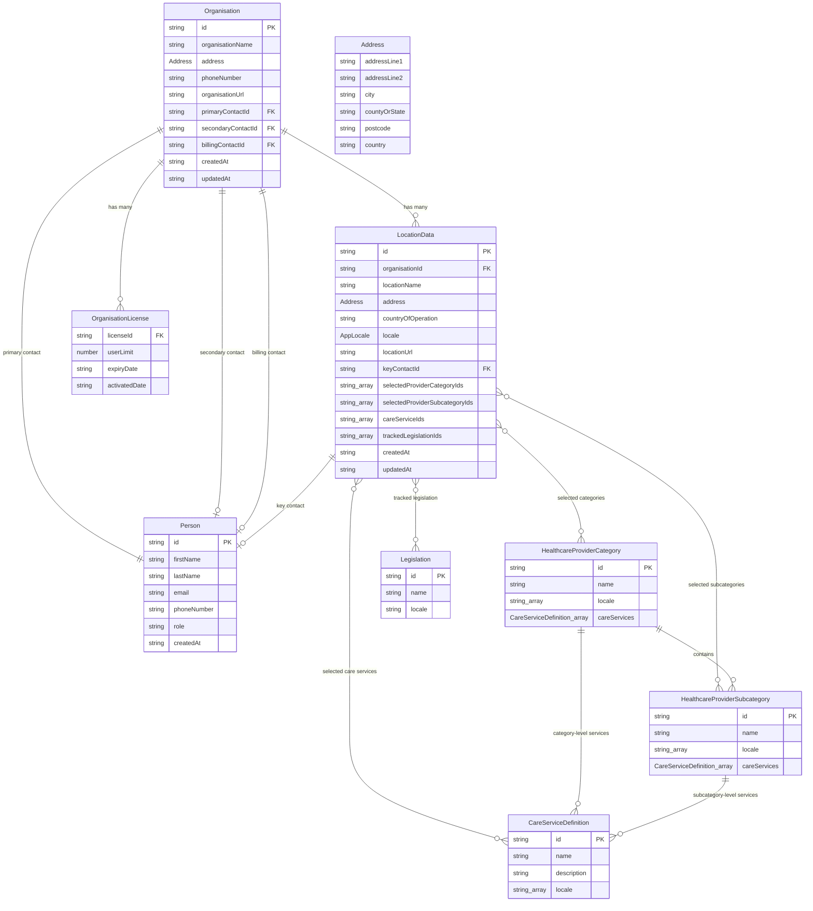

# Onboarding Flow Specification: Organisation & Location Setup

**Version**: 1.0  
**Date**: 2026-02-18  
**Status**: Draft  
**Branch**: `features/manuals`

---

## Table of Contents

1. [Overview](#1-overview)
2. [Onboarding Flow Summary](#2-onboarding-flow-summary)
3. [Step 1: Organisation Setup](#3-step-1-organisation-setup)
4. [Step 2: Location Setup](#4-step-2-location-setup)
5. [Data Structures & Type Definitions](#5-data-structures--type-definitions)
6. [Entity Relationship Diagram](#6-entity-relationship-diagram)
7. [Reference Data Structure](#7-reference-data-structure)
8. [Conditional UI Logic](#8-conditional-ui-logic)
9. [Validation Rules](#9-validation-rules)
10. [API Endpoints](#10-api-endpoints)
11. [State Management](#11-state-management)
12. [Toast Notifications & Demo Behaviour](#12-toast-notifications--demo-behaviour)
13. [Migration Notes](#13-migration-notes)

---

## 1. Overview

This specification defines the onboarding flow for SWP2, covering the setup of an Organisation and one or more Locations. The flow replaces the existing `LocationSettingsPage` component and introduces a preceding Organisation setup step.

### Goals

- Provide a clean, two-step onboarding: Organisation first, then Location(s)
- Support multiple locations with no hierarchy (ordinal naming: "First Location", "Second Location", etc.)
- Expose provider subcategories conditionally when a parent category is selected
- Dynamically display care services only when they exist for the selected category/subcategory
- Support four locales: **GB**, **Northern Ireland**, **Ireland**, **USA**
- Include full address fields for both Organisation and Location
- Allow copying Organisation details into the first Location for convenience

### Non-Goals

- No location duplication/cloning feature
- No maximum location limit
- No step counter in the UI (removed from the current implementation)

---

## 2. Onboarding Flow Summary

```
┌─────────────────────────┐       ┌─────────────────────────────────┐
│   Step 1: Organisation  │       │   Step 2: Location Setup        │
│                         │       │                                 │
│  - Organisation name    │       │  - [Copy from Org] link         │
│  - Primary contact      │  ──►  │  - Location name & address      │
│  - Organisation address │       │  - Provider categories          │
│  - Phone number         │       │    └─ Subcategories (conditional)│
│  - Organisation URL     │       │      └─ Care services (if any)  │
│                         │       │  - Key contact                  │
│                         │       │  - [+ Add Another Location]     │
└─────────────────────────┘       └─────────────────────────────────┘
```

**Navigation**:
- Step 1 → Step 2 via "Next" button (validates Organisation fields)
- Step 2 → "Back" returns to Step 1 (data preserved)
- Step 2 → "Complete Setup" finalises onboarding

---

## 3. Step 1: Organisation Setup

### 3.1 Layout

Single card containing all Organisation fields. No step counter.

### 3.2 Fields

| Field | Type | Required | Notes |
|-------|------|----------|-------|
| Organisation Name | Text input | Yes | Max 200 characters |
| Primary Contact: First Name | Text input | Yes | |
| Primary Contact: Last Name | Text input | Yes | |
| Primary Contact: Email | Email input | Yes | Standard email validation |
| Primary Contact: Phone | Tel input | Yes | |
| Organisation Address Line 1 | Text input | Yes | |
| Organisation Address Line 2 | Text input | No | |
| Organisation City | Text input | No | |
| Organisation County / State | Text input | No | |
| Organisation Postcode | Text input | Yes | |
| Organisation Country | Select (grouped) | Yes | Determines the Organisation's locale |
| Organisation Phone Number | Tel input | Yes | Organisation-level phone (may differ from contact's) |
| Organisation URL | URL input | No | |

### 3.3 Country Selection & Locale Mapping

The country dropdown uses the same grouped structure as the current implementation, but the locale mapping is extended to four values:

| Country Selection | Locale |
|-------------------|--------|
| England / Scotland / Wales (selected as "United Kingdom") | `GB` |
| Northern Ireland | `Northern Ireland` |
| Ireland (Republic of) | `Ireland` |
| United States | `USA` |
| All other countries | `GB` (default fallback) |

> **Implementation note**: The country list should include "Northern Ireland" as a distinct option separate from "United Kingdom" to correctly assign the locale. Alternatively, selecting "United Kingdom" could trigger a secondary prompt asking whether the organisation is in Northern Ireland.

### 3.4 Behaviour

- On "Next": validate all required fields, create/update the Organisation record and Person record (primary contact), then navigate to Step 2.
- The primary contact Person record is created with `role: 'primary_contact'`.
- The Organisation record stores a reference to this person via `primaryContactId`.

---

## 4. Step 2: Location Setup

### 4.1 Layout

Each location is rendered as a collapsible card. Locations are labelled with ordinal names:
- "First Location", "Second Location", "Third Location", etc.

When only one location exists, the card is expanded and non-collapsible. When multiple locations exist, all cards are collapsible. Adding a new location collapses existing cards and expands the new one.

### 4.2 Copy from Organisation

At the top of the **first** location card (and only the first), a link/button is displayed:

> **"Copy details from organisation"**

When clicked, this pre-fills:
- Address fields (line 1, line 2, city, county/state, postcode)
- Country of operation (and therefore locale)
- Location URL from Organisation URL
- Key contact defaults to the primary contact

### 4.3 Location Fields

| Field | Type | Required | Notes |
|-------|------|----------|-------|
| Location Name | Text input | Yes | Max 200 characters |
| Address Line 1 | Text input | Yes | |
| Address Line 2 | Text input | No | |
| City | Text input | No | |
| County / State | Text input | No | |
| Postcode | Text input | Yes | |
| Country of Operation | Select (grouped) | Yes | Determines locale for this location |
| Location URL | URL input | No | |
| Key Contact | Select + Add Person button | No | Dropdown of existing people + "Add new person" |

### 4.4 Provider Category Selection

Displayed after the location fields. Categories are filtered by the location's locale.

**Heading**: "What categories does this location fall into?"

Each category is a checkbox with an info tooltip (as in current implementation). Categories are displayed in a 2-column grid.

### 4.5 Subcategory Selection (Conditional)

When a provider category checkbox is checked:

1. A nested section appears below that category showing its subcategories as checkboxes
2. All subcategories for that category (filtered by locale) are shown
3. When the user selects a subcategory, the **unselected** subcategories are hidden, leaving only the selected one(s) visible — keeping the interface clean
4. If a selected subcategory is then deselected, all subcategories for that category become visible again
5. If the parent category is unchecked, all its subcategories are deselected and hidden

**Visual treatment**: Subcategories appear indented below their parent category, with a subtle left border or indent to show the hierarchy.

### 4.6 Care Services (Conditional)

Care services are displayed **only** when the selected provider category and/or subcategory has care services defined in the reference data.

- If the selected category has care services → show them
- If the selected subcategory has care services → show them
- If neither has care services → show nothing (no empty section, no heading)
- Care services from multiple selected categories/subcategories are merged into a single "Care Services" section, deduplicated by ID
- Each care service is a checkbox

**Heading** (when visible): "What care services does this location provide?"

**Visual treatment**: Blue gradient card (matching current design) with checkboxes in a 2-3 column grid.

### 4.7 Adding More Locations

A button at the bottom of the page:

> **"+ Add Another Location"**

Clicking this:
1. Saves the current state of all locations
2. Creates a new empty location card
3. Collapses all existing location cards
4. Expands the new location card
5. The new location is labelled with the next ordinal ("Second Location", "Third Location", etc.)

### 4.8 Removing Locations

Each location card (except when there is only one) has a "Remove" button in the header. Removing a location:
1. Prompts for confirmation
2. Removes the location
3. Re-numbers remaining locations (ordinal labels update)

### 4.9 Collapsed Card Summary

When a location card is collapsed, the header shows:
- Ordinal label + location name (e.g., "First Location — Manchester Care Home")
- Country of operation
- Number of selected categories
- Key contact name (if set)

---

## 5. Data Structures & Type Definitions

### 5.1 Address

```typescript
/**
 * Shared address structure used by both Organisation and Location entities.
 */
export interface Address {
  /** First line of address (street number + street name) */
  addressLine1: string;
  /** Second line of address (apartment, suite, unit, etc.) */
  addressLine2?: string;
  /** City or town */
  city?: string;
  /** County (UK/Ireland) or State (USA) */
  countyOrState?: string;
  /** Postcode (UK/Ireland) or ZIP code (USA) */
  postcode: string;
  /** ISO country code (e.g., 'gb', 'us', 'ie') or region identifier */
  country: string;
}
```

### 5.2 Organisation (Updated)

```typescript
/**
 * Organisation entity — top-level entity owning one or more Locations.
 * Created during Step 1 of onboarding.
 */
export interface Organisation {
  /** Unique identifier (UUID format) */
  id: string;
  /** Organisation display name */
  organisationName: string;
  /** Organisation headquarters address */
  address: Address;
  /** Organisation-level phone number */
  phoneNumber: string;
  /** Organisation website URL */
  organisationUrl?: string;
  /** Foreign key to the primary contact Person */
  primaryContactId: string;
  /** Foreign key to a secondary contact Person (optional) */
  secondaryContactId?: string;
  /** Foreign key to the billing contact Person (optional) */
  billingContactId?: string;
  /** Array of licences assigned to this Organisation */
  licenses: OrganisationLicense[];
  /** ISO 8601 creation timestamp */
  createdAt: string;
  /** ISO 8601 last-update timestamp */
  updatedAt: string;
}
```

### 5.3 Person (Unchanged)

```typescript
/**
 * A person associated with the Organisation (contact, team member, etc.).
 */
export interface Person {
  /** Unique identifier */
  id: string;
  /** First name */
  firstName: string;
  /** Last name */
  lastName: string;
  /** Email address */
  email: string;
  /** Phone number */
  phoneNumber: string;
  /** Role within the organisation */
  role?: 'primary_contact' | 'secondary_contact' | 'billing_contact' | 'team_member';
  /** ISO 8601 creation timestamp */
  createdAt: string;
}
```

### 5.4 LocationData (Updated)

```typescript
/**
 * Supported application locales.
 */
export type AppLocale = 'GB' | 'Northern Ireland' | 'Ireland' | 'USA';

/**
 * A single location belonging to an Organisation.
 * All locations are peers — there is no primary/secondary hierarchy.
 */
export interface LocationData {
  /** Unique identifier (UUID format) */
  id: string;
  /** Foreign key to the parent Organisation */
  organisationId: string;
  /** Human-readable location name */
  locationName: string;
  /** Full address for this location */
  address: Address;
  /** ISO country code for the country of operation */
  countryOfOperation: string;
  /** Derived locale based on country of operation */
  locale: AppLocale;
  /** Location website URL */
  locationUrl?: string;
  /** Foreign key to the key contact Person for this location */
  keyContactId?: string;
  /** Selected top-level provider category IDs */
  selectedProviderCategoryIds: string[];
  /** Selected provider subcategory IDs */
  selectedProviderSubcategoryIds: string[];
  /** Selected care service IDs */
  careServiceIds: string[];
  /** Tracked legislation IDs for this location */
  trackedLegislationIds: string[];
  /** ISO 8601 creation timestamp */
  createdAt: string;
  /** ISO 8601 last-update timestamp */
  updatedAt: string;
}
```

### 5.5 Healthcare Provider Category (Updated)

```typescript
/**
 * A care service that can be offered at a location,
 * linked to a specific provider category or subcategory.
 */
export interface CareServiceDefinition {
  /** Unique identifier for this care service */
  id: string;
  /** Human-readable service name */
  name: string;
  /** Optional description of the service */
  description?: string;
  /** Locales where this care service is applicable */
  locale: string[];
}

/**
 * A subcategory within a healthcare provider category.
 */
export interface HealthcareProviderSubcategory {
  /** Unique identifier */
  id: string;
  /** Human-readable subcategory name */
  name: string;
  /** Locales where this subcategory applies */
  locale: string[];
  /** Care services specific to this subcategory (if any) */
  careServices?: CareServiceDefinition[];
}

/**
 * A top-level healthcare provider category containing subcategories.
 */
export interface HealthcareProviderCategory {
  /** Unique identifier */
  id: string;
  /** Human-readable category name */
  name: string;
  /** Locales where this category applies */
  locale: string[];
  /** Subcategories within this provider category */
  subcategories: HealthcareProviderSubcategory[];
  /** Care services at the category level (if any — these apply to ALL subcategories) */
  careServices?: CareServiceDefinition[];
}

/**
 * Registry of all healthcare provider categories, keyed by category slug.
 */
export interface HealthcareProviderTypes {
  [categorySlug: string]: HealthcareProviderCategory;
}
```

### 5.6 Onboarding State

```typescript
/**
 * Represents the complete state of the onboarding wizard.
 * Used for in-memory state management during the flow.
 */
export interface OnboardingState {
  /** Current step index (0 = Organisation, 1 = Locations) */
  currentStep: number;
  /** Organisation data being configured */
  organisation: Partial<Organisation>;
  /** Primary contact being configured */
  primaryContact: Partial<Person>;
  /** Array of locations being configured */
  locations: Partial<LocationData>[];
  /** All people created during onboarding */
  people: Person[];
  /** Whether the onboarding has been completed */
  isComplete: boolean;
}
```

---

## 6. Entity Relationship Diagram



---

## 7. Reference Data Structure

### 7.1 Provider Categories with Care Services

The existing `HEALTHCARE_PROVIDER_TYPES` constant in `src/data/healthcare-provider-types.ts` must be extended. Each category and subcategory gains an optional `careServices` array.

**Example** — Long-Term Care with care services at the category level:

```typescript
"long_term_care": {
  id: "long_term_care",
  name: "Long-Term Care and Social Care",
  locale: ["us", "uk", "ni", "ie"],
  careServices: [
    { id: "rehabilitation", name: "Rehabilitation Services", locale: ["us", "uk", "ni", "ie"] },
    { id: "homeHealth", name: "Home Health Care", locale: ["us", "uk", "ni", "ie"] },
    { id: "palliative", name: "Palliative Care", locale: ["us", "uk", "ni", "ie"] },
    { id: "physicalTherapy", name: "Physical Therapy", locale: ["us", "uk", "ni", "ie"] },
    { id: "endOfLife", name: "End-of-Life Care", locale: ["us", "uk", "ni", "ie"] },
    { id: "alzheimers", name: "Alzheimer's Care", locale: ["us", "uk", "ni", "ie"] },
    { id: "memory", name: "Memory Care", locale: ["us", "uk", "ni", "ie"] },
    { id: "assistedLiving", name: "Assisted Living Support", locale: ["us", "uk", "ni", "ie"] },
    { id: "skilledNursing", name: "Skilled Nursing Care", locale: ["us", "uk", "ni", "ie"] },
    { id: "occupational", name: "Occupational Therapy", locale: ["us", "uk", "ni", "ie"] },
    { id: "dementia", name: "Dementia Care", locale: ["us", "uk", "ni", "ie"] },
    { id: "respite", name: "Respite Care", locale: ["us", "uk", "ni", "ie"] },
  ],
  subcategories: [
    {
      id: "nursing_homes",
      name: "Nursing Homes / Care Homes",
      locale: ["us", "uk", "ni", "ie"],
      // Subcategory-level care services could be added here if they are
      // more specific than the parent category's services.
    },
    // ... other subcategories
  ]
}
```

**Example** — Mental Health with subcategory-level care services:

```typescript
"mental_health_services": {
  id: "mental_health",
  name: "Mental Health and Behavioral Health Services",
  locale: ["us", "uk", "ni", "ie"],
  // No category-level care services
  subcategories: [
    {
      id: "substance_abuse_facilities",
      name: "Substance Abuse Treatment Facilities",
      locale: ["us", "uk", "ni", "ie"],
      careServices: [
        { id: "detox", name: "Detoxification Services", locale: ["us", "uk", "ni", "ie"] },
        { id: "outpatient_rehab", name: "Outpatient Rehabilitation", locale: ["us", "uk", "ni", "ie"] },
        { id: "inpatient_rehab", name: "Inpatient Rehabilitation", locale: ["us", "uk", "ni", "ie"] },
      ]
    },
    // ... other subcategories
  ]
}
```

### 7.2 Locale Identifiers in Reference Data

Reference data uses lowercase locale codes that map to the `AppLocale` type:

| Reference data code | `AppLocale` value |
|---------------------|-------------------|
| `"uk"` | `"GB"` |
| `"ni"` | `"Northern Ireland"` |
| `"ie"` | `"Ireland"` |
| `"us"` | `"USA"` |

A utility function handles this mapping:

```typescript
function mapCountryToLocale(countryCode: string): AppLocale {
  switch (countryCode) {
    case 'us': return 'USA';
    case 'ie': return 'Ireland';
    case 'ni': return 'Northern Ireland';
    case 'gb':
    case 'uk':
    default:   return 'GB';
  }
}
```

### 7.3 Country List Updates

The country select dropdown must be updated:

- **"United Kingdom"** entry is replaced with **"United Kingdom (England, Scotland & Wales)"** with value `"gb"`
- A new entry **"Northern Ireland"** is added with value `"ni"`, placed in the "Primary Markets" group alongside UK and Ireland
- **"Ireland"** retains value `"ie"`
- **"United States"** retains value `"us"`

---

## 8. Conditional UI Logic

### 8.1 Category → Subcategory Flow

```
User checks category checkbox
  └─► Subcategory section appears below the category
       └─► All locale-filtered subcategories shown as checkboxes
            └─► User checks a subcategory
                 └─► Unselected subcategories HIDE
                      (only selected ones remain visible)
                 └─► User unchecks the subcategory
                      └─► All subcategories become visible again

User unchecks category checkbox
  └─► All subcategories deselected and hidden
  └─► Any care services from this category/its subcategories are deselected
```

### 8.2 Category/Subcategory → Care Services Flow

```
For each selected category:
  1. Collect careServices[] from the category (if any)
  2. For each selected subcategory in that category:
     a. Collect careServices[] from the subcategory (if any)
  3. Merge all collected care services, deduplicate by ID
  4. Filter by location's locale

If merged list is empty → show nothing
If merged list has entries → show "Care Services" section with checkboxes
```

### 8.3 Subcategory Visibility State Machine

```
┌──────────────────┐
│  CATEGORY_OFF    │  (category unchecked)
│  No subcats shown│
└────────┬─────────┘
         │ category checked
         ▼
┌──────────────────┐
│  ALL_VISIBLE     │  (category checked, no subcats selected)
│  All subcats     │
│  shown           │
└────────┬─────────┘
         │ subcategory selected
         ▼
┌──────────────────┐
│  FILTERED        │  (one or more subcats selected)
│  Only selected   │
│  subcats shown   │
│                  │◄──── additional subcats selected/deselected
└────────┬─────────┘      (stays in FILTERED if ≥1 selected)
         │ last subcategory deselected
         ▼
┌──────────────────┐
│  ALL_VISIBLE     │  (back to showing all)
└──────────────────┘
```

### 8.4 Copy from Organisation Logic

When "Copy details from organisation" is clicked on the first location:

| Organisation field | Location field |
|-------------------|----------------|
| `address.addressLine1` | `address.addressLine1` |
| `address.addressLine2` | `address.addressLine2` |
| `address.city` | `address.city` |
| `address.countyOrState` | `address.countyOrState` |
| `address.postcode` | `address.postcode` |
| `address.country` | `countryOfOperation` (+ derive locale) |
| `organisationUrl` | `locationUrl` |
| `primaryContactId` | `keyContactId` |

The copy does **not** set `locationName` — the user must always provide this manually.

---

## 9. Validation Rules

### 9.1 Step 1: Organisation

| Field | Rules |
|-------|-------|
| Organisation Name | Required, non-empty, max 200 chars |
| Primary Contact First Name | Required, non-empty |
| Primary Contact Last Name | Required, non-empty |
| Primary Contact Email | Required, valid email format |
| Primary Contact Phone | Required, non-empty |
| Address Line 1 | Required, non-empty |
| Postcode | Required, non-empty |
| Country | Required, must be a valid country code |
| Organisation Phone | Required, non-empty |
| Organisation URL | Optional, valid URL format if provided |

### 9.2 Step 2: Location (per location)

| Field | Rules |
|-------|-------|
| Location Name | Required, non-empty, max 200 chars |
| Address Line 1 | Required, non-empty |
| Postcode | Required, non-empty |
| Country of Operation | Required, must be a valid country code |
| Provider Categories | At least one category must be selected |
| Care Services | If care services are displayed, at least one must be selected |
| Location URL | Optional, valid URL format if provided |

### 9.3 Cross-Location Validation

- At least one location must be configured before completing setup
- Location names should be unique within the Organisation (warn, not block)

### 9.4 "Next" / "Complete Setup" Button State

The action button is disabled until all required validations pass for the current step.

---

## 10. API Endpoints

### 10.1 Organisation

| Method | Path | Description |
|--------|------|-------------|
| `GET` | `/api/v1/organisations/:id` | Get Organisation by ID |
| `POST` | `/api/v1/organisations` | Create Organisation |
| `PATCH` | `/api/v1/organisations/:id` | Update Organisation |

### 10.2 People

| Method | Path | Description |
|--------|------|-------------|
| `GET` | `/api/v1/people` | List all people (optional `?organisationId=`) |
| `GET` | `/api/v1/people/:id` | Get Person by ID |
| `POST` | `/api/v1/people` | Create Person |
| `PATCH` | `/api/v1/people/:id` | Update Person |
| `DELETE` | `/api/v1/people/:id` | Delete Person |

### 10.3 Locations (Existing — no changes)

| Method | Path | Description |
|--------|------|-------------|
| `GET` | `/api/v1/locations` | List all locations (optional `?organisationId=`) |
| `GET` | `/api/v1/locations/:id` | Get Location by ID |
| `POST` | `/api/v1/locations` | Create Location |
| `PATCH` | `/api/v1/locations/:id` | Update Location |
| `DELETE` | `/api/v1/locations/:id` | Delete Location |

### 10.4 Reference Data (Read-Only)

| Method | Path | Description |
|--------|------|-------------|
| `GET` | `/api/v1/reference/provider-types` | Get all provider categories (optional `?locale=`) |
| `GET` | `/api/v1/reference/care-services` | Get all care services (optional `?categoryId=&locale=`) |
| `GET` | `/api/v1/reference/countries` | Get supported countries list |

---

## 11. State Management

### 11.1 Onboarding Wizard State

The onboarding flow maintains a single `OnboardingState` object in React state (lifted to the parent component or managed via context).

```typescript
const [onboardingState, setOnboardingState] = useState<OnboardingState>({
  currentStep: 0,
  organisation: {},
  primaryContact: {},
  locations: [{}],  // Start with one empty location
  people: [],
  isComplete: false,
});
```

### 11.2 Persistence Strategy

- **During onboarding**: State is held in memory (React state). No API calls until step completion.
- **On Step 1 "Next"**: Organisation and primary contact are saved via API.
- **On Step 2 "Complete Setup"**: All locations are saved via API (create for new, update for existing).
- **On "Back"**: No API calls; in-memory state is preserved.
- **Browser refresh during onboarding**: State is lost. This is acceptable for V1. A future enhancement could persist to `sessionStorage`.

### 11.3 Location State Shape (UI-level)

For the UI, each location in the array tracks additional transient state:

```typescript
interface LocationUIState {
  /** The LocationData being edited */
  data: Partial<LocationData>;
  /** Whether this location card is expanded */
  isExpanded: boolean;
  /** Tracks which category sections have their subcategories open */
  expandedCategoryIds: Set<string>;
  /** Derived: merged care services available for current selections */
  availableCareServices: CareServiceDefinition[];
}
```

---

## 12. Toast Notifications & Demo Behaviour

### 12.1 Country Selection Toast

When a country is selected (on either Organisation or Location), display:

> "**{N} pieces of legislation and regulation added to your Repository**"

Where `{N}` is the count of default legislation items for the selected locale.

```typescript
// TODO: Replace hardcoded count with dynamic count.
// The count should be calculated by:
// 1. Looking up the locale for the selected country
// 2. Querying the legislation reference data for that locale
// 3. Counting the number of default legislation items
// 4. Displaying the count in the toast notification
//
// Example: toast.success(`${legislationCount} pieces of legislation and regulation added to your Repository`);
```

### 12.2 First Category Selection Toast

When the first provider category is selected for any location:

> "**Added new legislative instruments to repository.**"

This toast fires only once per location (tracked via a `hasShownCategoryToast` flag per location).

### 12.3 Person Added Toast

When a new person is added via the Add Person dialog:

> "**{First Name} {Last Name} has been added.**"

---

## 13. Migration Notes

### 13.1 Deprecated Types to Remove

The following types are deprecated and should be removed when the new onboarding is implemented:

- `SecondaryLocationData` — replaced by the flat `LocationData[]` array
- `ProviderCategorySelection` — replaced by `selectedProviderCategoryIds: string[]`
- `LocationLegislationTracking` — replaced by `trackedLegislationIds` on `LocationData`

### 13.2 Updated Types

- `Organisation` — gains `address: Address` field, `organisationUrl` field. The old flat `hqAddress` / `hqCountry` fields are replaced.
- `LocationData` — gains `address: Address` field. The old `countryOfOperation` is retained but now complements the structured address.
- `DemoMode` type — renamed to `AppLocale` with the same values: `'GB' | 'Northern Ireland' | 'Ireland' | 'USA'`.
- `HealthcareProviderCategory` — gains optional `careServices: CareServiceDefinition[]`.
- `HealthcareProviderSubcategory` — gains optional `careServices: CareServiceDefinition[]`.

### 13.3 New Types

- `Address` — shared address structure
- `CareServiceDefinition` — care service within reference data
- `OnboardingState` — wizard state management
- `AppLocale` — locale type alias (replaces `DemoMode`)

### 13.4 Component Changes

| Current | New |
|---------|-----|
| `LocationSettingsPage.tsx` | Split into `OnboardingWizard.tsx` (parent), `OrganisationSetupStep.tsx` (step 1), `LocationSetupStep.tsx` (step 2) |
| `AddPersonDialog.tsx` | Reused as-is |
| — | New: `LocationCard.tsx` (collapsible location card) |
| — | New: `ProviderCategorySelector.tsx` (category + subcategory + care services) |
| — | New: `AddressFields.tsx` (reusable address form fields) |

### 13.5 Reference Data Changes

- `src/data/healthcare-provider-types.ts` — extend each category/subcategory with optional `careServices` arrays
- Add locale codes `"ni"` and `"ie"` to all applicable entries
- Country list updated with Northern Ireland as a distinct entry

---

## Appendix A: Ordinal Location Labels

```typescript
const ORDINAL_LABELS = [
  'First', 'Second', 'Third', 'Fourth', 'Fifth',
  'Sixth', 'Seventh', 'Eighth', 'Ninth', 'Tenth',
];

function getLocationLabel(index: number): string {
  const ordinal = ORDINAL_LABELS[index] ?? `Location ${index + 1}`;
  return `${ordinal} Location`;
}
```

## Appendix B: Full Country-to-Locale Mapping

| Country Code | Country Name | Locale |
|---|---|---|
| `gb` | United Kingdom (England, Scotland & Wales) | `GB` |
| `ni` | Northern Ireland | `Northern Ireland` |
| `ie` | Ireland | `Ireland` |
| `us` | United States | `USA` |
| `ca` | Canada | `USA` |
| `au` | Australia | `GB` |
| `nz` | New Zealand | `GB` |
| `fr` | France | `GB` |
| `de` | Germany | `GB` |
| _(all other EU/European)_ | _(various)_ | `GB` |
